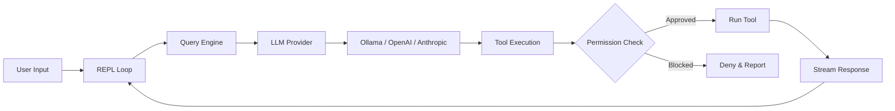

<p align="center">
  
</p>

# OpenHarness

```
        ___
       /   \
      (     )        ___  ___  ___ _  _ _  _   _ ___ _  _ ___ ___ ___
       `~w~`        / _ \| _ \| __| \| | || | /_\ | _ \ \| | __/ __/ __|
       (( ))       | (_) |  _/| _|| .` | __ |/ _ \|   / .` | _|\__ \__ \
        ))((        \___/|_|  |___|_|\_|_||_/_/ \_\_|_\_|\_|___|___/___/
       ((  ))
        `--`
```

AI coding agent in your terminal. Works with any LLM -- free local models or cloud APIs.

[](https://www.npmjs.com/package/@zhijiewang/openharness) [](https://www.npmjs.com/package/@zhijiewang/openharness) [](LICENSE)     [](https://github.com/zhijiewong/openharness) [](https://github.com/zhijiewong/openharness/issues) [](https://github.com/zhijiewong/openharness/pulls)

## Table of Contents

- [Quick Start](#quick-start)
- [Why OpenHarness?](#why-openharness)
- [Terminal UI](#terminal-ui)
- [Tools (35)](#tools-35)
- [Slash Commands (33)](#slash-commands-33)
- [Permission Modes](#permission-modes)
- [Hooks](#hooks)
- [Checkpoints & Rewind](#checkpoints--rewind)
- [Agent Roles](#agent-roles)
- [Headless Mode & CI/CD](#headless-mode)
- [Cybergotchi](#cybergotchi)
- [MCP Servers](#mcp-servers)
- [Providers](#providers)
- [FAQ](#faq)
- [Install](#install)
- [Development](#development)
- [Contributing](#contributing)
- [Community](#community)

---

<video src="https://github.com/user-attachments/assets/ed19a2cc-14d3-4db3-aa5b-3dc07c444498" controls width="100%"></video>

*OpenHarness reading files, running commands, and editing code — powered by a local Ollama model.*

---

## Quick Start

```bash
npm install -g @zhijiewang/openharness
oh
```

That's it. OpenHarness auto-detects Ollama and starts chatting. No API key needed.

```bash
oh init                               # interactive setup wizard (provider + cybergotchi)
oh                                    # auto-detect local model
oh --model ollama/qwen2.5:7b         # specific model
oh --model gpt-4o                     # cloud model (needs OPENAI_API_KEY)
oh --trust                            # auto-approve all tool calls
oh --auto                             # auto-approve, block dangerous bash
oh -p "fix the tests" --trust         # headless mode (single prompt, exit)
oh run "review code" --json           # CI/CD with JSON output
```

**In-session commands:**
```
/rewind                               # undo last AI file change (checkpoint restore)
/roles                                # list agent specializations
/vim                                  # toggle vim mode
Ctrl+O                                # flush transcript to scrollback for review
```

## Why OpenHarness?

Most AI coding agents are locked to one provider or cost $20+/month. OpenHarness works with any LLM -- run it free with Ollama on your own machine, or connect to any cloud API. Every AI edit is git-committed and reversible with `/undo`.

|  | OpenHarness | Claude Code | Aider | OpenCode |
|---|---|---|---|---|
| Any LLM | Yes (Ollama, OpenAI, Anthropic, OpenRouter, any OpenAI-compatible) | Anthropic only | Yes | Yes |
| Free local models | Ollama native | No | Yes | Yes |
| Tools | 35 with permission gates | 43+ | File-focused | 20+ |
| Permission modes | 7 (ask, trust, deny, acceptEdits, plan, auto, bypass) | 7 | Basic | Basic |
| Git integration | Auto-commit + /undo + /rewind checkpoints | Yes | Deep git | Basic |
| Slash commands | 30+ built-in | 80+ | Some | Some |
| Headless/CI mode | `oh -p "prompt"` or `oh run --json` | Yes | Yes | Yes |
| GitHub Action | Built-in PR review action | Yes | No | No |
| Agent roles | 6 specializations (reviewer, tester, debugger...) | Yes | No | No |
| Vim mode | hjkl, w/b/e, 0/$, x, d, i/a/I/A/o | Full vim | No | No |
| Prompt caching | Anthropic cache_control | Yes | No | No |
| Bash security | AST-based command analysis | AST analysis | No | No |
| Companion | Cybergotchi virtual pet | Basic | No | No |
| Terminal UI | Sequential renderer (Ink pattern) | React + Ink | Basic | BubbleTea |
| Language | TypeScript | TypeScript | Python | Go |
| License | MIT | Proprietary | Apache 2.0 | MIT |
| Price | Free (BYOK) | $20+/month | Free (BYOK) | Free (BYOK) |

## Terminal UI

OpenHarness features a sequential terminal renderer inspired by Ink/Claude Code's default mode. Completed messages flush to native scrollback (scrollable), while the live area (streaming, spinner, input) rewrites in-place using relative cursor movement.

### Keybindings

| Key | Action |
|-----|--------|
| `Enter` | Submit prompt |
| `Alt+Enter` | Insert newline (multi-line input) |
| `↑` / `↓` | Navigate input history |
| `Ctrl+C` | Cancel current request / exit |
| `Ctrl+A` / `Ctrl+E` | Jump to start / end of input |
| `Ctrl+O` | Toggle thinking block expansion |
| `Ctrl+K` | Toggle code block expansion in messages |
| `Tab` | Autocomplete slash commands / file paths / cycle tool outputs |
| `/vim` | Toggle Vim mode (normal/insert) |

Scrolling is handled by the terminal's native scrollbar. Completed messages flow into the terminal scrollback buffer. Use your terminal's search (e.g., `Ctrl+Shift+F` in VS Code) to search conversation history.

### Features

- **Markdown rendering** — headings, code blocks, bold, italic, lists, tables, blockquotes, links
- **Syntax highlighting** — keywords, strings, comments, numbers, types (JS/TS/Python/Rust/Go and 20+ languages)
- **Collapsible code blocks** — blocks over 8 lines auto-collapse; `Ctrl+K` to expand all
- **Collapsible thinking** — thinking blocks collapse to a one-line summary after completion; `Ctrl+O` to expand
- **Shimmer spinner** — animated "Thinking" indicator with color transitions (magenta → yellow at 30s → red at 60s)
- **Tool call display** — args preview, live streaming output, result summaries (line counts, elapsed time), expand/collapse with `Tab`
- **Permission prompts** — bordered box with risk coloring, bold colored **Y**es/**N**o/**D**iff keys, syntax-highlighted inline diffs
- **Status line** — model name, token count, cost, context usage bar (customizable via config)
- **Context warning** — yellow alert when context window exceeds 75%
- **Native terminal scrollbar** — completed messages flow into scrollback; use your terminal's scrollbar and search
- **Multi-line input** — `Alt+Enter` for newlines; paste detection auto-inserts newlines
- **Autocomplete** — slash commands and file paths with descriptions; Tab to cycle
- **File path autocomplete** — Tab-completes paths with `[dir]`/`[file]` indicators
- **Session browser** — `/browse` to interactively browse and resume past sessions
- **Companion mascot** — animated Cybergotchi in the footer (toggle with `/companion off|on`)

### Themes

```bash
oh --light                    # light theme for bright terminals
/theme light                  # switch mid-session (saved automatically)
/theme dark                   # switch back
```

Theme preference is saved to `.oh/config.yaml` and persists across sessions.

### Custom Status Line

Customize the status bar format in `.oh/config.yaml`:

```yaml
statusLineFormat: '{model} │ {tokens} │ {cost} │ {ctx}'
```

Available variables: `{model}`, `{tokens}` (input↑ output↓), `{cost}` ($X.XXXX), `{ctx}` (context usage bar). Empty sections are automatically collapsed.

## Tools (35)

| Tool | Risk | Description |
|------|------|-------------|
| **Core** | | |
| Bash | high | Execute shell commands with live streaming output (AST safety analysis) |
| Read | low | Read files with line ranges, PDF support |
| ImageRead | low | Read images/PDFs for multimodal analysis |
| Write | medium | Create or overwrite files |
| Edit | medium | Search-and-replace edits |
| MultiEdit | medium | Atomic multi-file edits (all succeed or none) |
| Glob | low | Find files by pattern |
| Grep | low | Regex content search with context lines |
| LS | low | List directory contents with sizes |
| **Web** | | |
| WebFetch | medium | Fetch URL content (SSRF-protected) |
| WebSearch | medium | Search the web |
| RemoteTrigger | high | HTTP requests to webhooks/APIs |
| **Tasks** | | |
| TaskCreate | low | Create structured tasks |
| TaskUpdate | low | Update task status |
| TaskList | low | List all tasks |
| TaskGet | low | Get task details |
| TaskStop | low | Stop a running task |
| TaskOutput | low | Get task output |
| **Agents** | | |
| Agent | medium | Spawn a sub-agent (with role specialization) |
| ParallelAgent | medium | Dispatch multiple agents with DAG dependencies |
| SendMessage | low | Agent-to-agent peer messaging |
| AskUser | low | Ask user a question with options |
| **Scheduling** | | |
| CronCreate | medium | Schedule recurring tasks |
| CronDelete | medium | Remove scheduled tasks |
| CronList | low | List all scheduled tasks |
| **Planning** | | |
| EnterPlanMode | low | Enter structured planning mode |
| ExitPlanMode | low | Exit planning mode |
| **Code Intelligence** | | |
| Diagnostics | low | LSP-based code diagnostics |
| NotebookEdit | medium | Edit Jupyter notebooks |
| **Memory & Discovery** | | |
| Memory | low | Save/list/search persistent memories |
| Skill | low | Invoke a skill from .oh/skills/ |
| ToolSearch | low | Find tools by description |
| **Git Worktrees** | | |
| EnterWorktree | medium | Create isolated git worktree |
| ExitWorktree | medium | Remove a git worktree |
| **Process** | | |
| KillProcess | high | Stop processes by PID or name |

Low-risk read-only tools auto-approve. Medium and high risk tools require confirmation in `ask` mode. Use `--trust` or `--auto` to skip prompts.

## Slash Commands (33)

Type these during a chat session. Aliases: `/q` exit, `/h` help, `/c` commit, `/m` model, `/s` status.

**Session:**
| Command | Description |
|---------|-------------|
| `/clear` | Clear conversation history |
| `/compact` | Compress conversation to free context |
| `/export` | Export conversation to markdown |
| `/history [n]` | List recent sessions; `/history search <term>` to search |
| `/browse` | Interactive session browser with preview |
| `/resume <id>` | Resume a saved session |
| `/fork` | Fork current session |

**Git:**
| Command | Description |
|---------|-------------|
| `/diff` | Show uncommitted git changes |
| `/undo` | Undo last AI commit |
| `/commit [msg]` | Create a git commit |
| `/log` | Show recent git commits |

**Info:**
| Command | Description |
|---------|-------------|
| `/help` | Show all available commands (categorized) |
| `/cost` | Show session cost and token usage |
| `/status` | Show model, mode, git branch, MCP servers |
| `/config` | Show configuration |
| `/files` | List files in context |
| `/model <name>` | Switch model mid-session |
| `/memory` | View and search memories |

**Settings:**
| Command | Description |
|---------|-------------|
| `/theme dark\|light` | Switch theme (saved to config) |
| `/vim` | Toggle Vim mode |
| `/companion off\|on` | Toggle companion visibility |

**AI:**
| Command | Description |
|---------|-------------|
| `/plan <task>` | Enter plan mode |
| `/review` | Review recent code changes |

**Pet:**
| Command | Description |
|---------|-------------|
| `/cybergotchi` | Feed, pet, rest, status, rename, or reset your companion |

## Permission Modes

Control how aggressively OpenHarness auto-approves tool calls:

| Mode | Flag | Behavior |
|------|------|----------|
| `ask` | `--permission-mode ask` | Prompt for medium/high risk operations (default) |
| `trust` | `--trust` | Auto-approve everything |
| `deny` | `--deny` | Only allow low-risk read-only operations |
| `acceptEdits` | `--permission-mode acceptEdits` | Auto-approve file edits, ask for Bash/WebFetch/Agent |
| `plan` | `--permission-mode plan` | Read-only mode — block all write operations |
| `auto` | `--auto` | Auto-approve all, block dangerous bash (AST-analyzed) |
| `bypassPermissions` | `--permission-mode bypassPermissions` | Approve everything unconditionally (CI only) |

Bash commands are analyzed by a lightweight AST parser that detects destructive patterns (`rm -rf`, `git push --force`, `curl | bash`, etc.) and adjusts risk level accordingly.

Set permanently in `.oh/config.yaml`: `permissionMode: 'acceptEdits'`

## Hooks

Run shell scripts automatically at key session events by adding a `hooks` block to `.oh/config.yaml`:

```yaml
hooks:
  - event: sessionStart
    command: "echo 'Session started' >> ~/.oh/session.log"

  - event: preToolUse
    command: "scripts/check-tool.sh"
    match: Bash   # optional: only trigger for this tool name

  - event: postToolUse
    command: "scripts/after-tool.sh"

  - event: sessionEnd
    command: "scripts/cleanup.sh"
```

**Event types:**
- `sessionStart` — fires once when the session begins
- `preToolUse` — fires before each tool call; **exit code 1 blocks the tool** and returns an error to the model
- `postToolUse` — fires after each tool call completes
- `sessionEnd` — fires when the session ends

**Environment variables** available to hook scripts:

| Variable | Description |
|----------|-------------|
| `OH_EVENT` | Event type (`sessionStart`, `preToolUse`, etc.) |
| `OH_TOOL_NAME` | Name of the tool being called (tool events only) |
| `OH_TOOL_ARGS` | JSON-encoded tool arguments (tool events only) |
| `OH_TOOL_OUTPUT` | JSON-encoded tool output (`postToolUse` only) |

Use `match` to restrict a hook to a specific tool name (e.g., `match: Bash` only triggers for the Bash tool).

## Cybergotchi

OpenHarness ships with a Tamagotchi-style companion that lives in the side panel. It reacts to your session in real time — celebrating streaks, complaining when tools fail, and getting hungry if you ignore it.

**Hatch one:**
```
oh init        # wizard includes cybergotchi setup
/cybergotchi   # or hatch mid-session
```

**Commands:**
```
/cybergotchi feed      # +30 hunger
/cybergotchi pet       # +20 happiness
/cybergotchi rest      # +40 energy
/cybergotchi status    # show needs + lifetime stats
/cybergotchi rename    # give it a new name
/cybergotchi reset     # start over with a new species
```

**Needs** decay over time (hunger fastest, happiness slowest). Feed and pet your gotchi to keep it happy.

**Evolution** — your gotchi evolves based on lifetime milestones:
- Stage 1 (✦ magenta): 10 sessions or 50 commits
- Stage 2 (★ yellow + crown): 100 tasks completed or a 25-tool streak

**18 species** to choose from: duck, cat, owl, penguin, rabbit, turtle, snail, octopus, axolotl, cactus, mushroom, chonk, capybara, goose, and more.

## MCP Servers

Connect any MCP (Model Context Protocol) server by editing `.oh/config.yaml`:

```yaml
provider: anthropic
model: claude-sonnet-4-6
permissionMode: ask
mcpServers:
  - name: filesystem
    command: npx
    args: ["-y", "@modelcontextprotocol/server-filesystem", "/tmp"]
  - name: github
    command: npx
    args: ["-y", "@modelcontextprotocol/server-github"]
    env:
      GITHUB_PERSONAL_ACCESS_TOKEN: ghp_...
```

MCP tools appear alongside built-in tools. `/status` shows connected servers.

## Git Integration

OpenHarness auto-commits AI edits in git repos:

```
oh: Edit src/app.ts                    # auto-committed with "oh:" prefix
oh: Write tests/app.test.ts
```

- Every AI file change is committed automatically
- `/undo` reverts the last AI commit (only OH commits, never yours)
- `/diff` shows what changed
- Your dirty files are safe — committed separately before AI edits

## Checkpoints & Rewind

Every file modification is automatically checkpointed before execution. If something goes wrong:

```
/rewind           # restore files from the last checkpoint
/undo             # revert the last AI git commit
```

Checkpoints are stored in `.oh/checkpoints/` and cover FileWrite, FileEdit, and Bash commands that modify files.

## Agent Roles

Dispatch specialized sub-agents for focused tasks:

```
/roles            # list all available roles
```

| Role | Description |
|------|-------------|
| `code-reviewer` | Find bugs, security issues, style problems |
| `test-writer` | Generate unit and integration tests |
| `docs-writer` | Write documentation and comments |
| `debugger` | Systematic bug investigation |
| `refactorer` | Simplify code without changing behavior |
| `security-auditor` | OWASP, injection, secrets, CVE scanning |

The LLM can dispatch these via `Agent({ subagent_type: 'code-reviewer', prompt: '...' })`.

## Headless Mode

Run a single prompt without interactive UI — perfect for CI/CD and scripting:

```bash
# Chat command with -p flag (recommended)
oh -p "fix the failing tests" --model ollama/llama3 --trust
oh -p "review src/query.ts" --auto --output-format json

# Run command (alternative)
oh run "fix the failing tests" --model ollama/llama3 --trust
oh run "add error handling to api.ts" --json    # JSON output

# Pipe stdin
cat error.log | oh run "what's wrong here?"
git diff | oh run "review these changes"
```

### GitHub Action for PR Review

OpenHarness includes a built-in GitHub Action for automated code review:

```yaml
# .github/workflows/ai-review.yml
on:
  pull_request:
    types: [opened, synchronize]

jobs:
  review:
    runs-on: ubuntu-latest
    steps:
      - uses: actions/checkout@v4
        with:
          fetch-depth: 0
      - uses: ./.github/actions/review
        with:
          model: 'claude-sonnet-4-6'
          anthropic_api_key: ${{ secrets.ANTHROPIC_API_KEY }}
```

Exit code 0 on success, 1 on failure.

## Providers

```bash
# Local (free, no API key needed)
oh --model ollama/llama3
oh --model ollama/qwen2.5:7b

# Cloud
OPENAI_API_KEY=sk-... oh --model gpt-4o
ANTHROPIC_API_KEY=sk-ant-... oh --model claude-sonnet-4-6
OPENROUTER_API_KEY=sk-or-... oh --model openrouter/meta-llama/llama-3-70b

# llama.cpp / GGUF
oh --model llamacpp/my-model

# LM Studio
oh --model lmstudio/my-model
```

### llama.cpp / GGUF (local, no Ollama needed)

For direct GGUF support via `llama-server`, without the overhead of Ollama. Often faster for large models.

**Prerequisites:**
- Install llama.cpp: `brew install llama.cpp` or download from [github.com/ggml-org/llama.cpp](https://github.com/ggml-org/llama.cpp)
- Download a GGUF model (e.g., from [HuggingFace](https://huggingface.co))

**Start llama-server:**
```bash
llama-server --model ./your-model.gguf --port 8080 --alias my-model
```

**Configure via `oh init`:**
- Run `oh init` and select "llama.cpp / GGUF" when prompted

**Or configure manually** in `.oh/config.yaml`:
```yaml
provider: llamacpp
model: my-model
baseUrl: http://localhost:8080
permissionMode: ask
```

**Run:**
```bash
oh
oh --model llamacpp/my-model
oh models                    # list available models
```

## Project Rules

Create `.oh/RULES.md` in any repo (or run `oh init`):

```markdown
- Always run tests after changes
- Use strict TypeScript
- Never commit to main directly
```

Rules load automatically into every session.

## How It Works



## FAQ

**Does it work offline?**
Yes. Use Ollama with a local model — no internet or API key needed.

**How much does it cost?**
Free. OpenHarness is MIT licensed. You bring your own API key (BYOK) for cloud models, or use Ollama for free.

**Is it safe?**
Yes. 7 permission modes control what tools can do. Bash commands are analyzed by an AST parser that blocks destructive patterns (`rm -rf`, `curl | bash`, etc.). Every file change is checkpointed and reversible with `/rewind`.

**Can I use it in CI/CD?**
Yes. Use `oh -p "prompt" --auto` for headless execution, or the built-in GitHub Action for PR reviews.

**Does it support my language/framework?**
Yes. OpenHarness is language-agnostic — it reads, writes, and executes code in any language. Syntax highlighting covers 20+ languages.

**How does it compare to Claude Code?**
~90% feature parity for CLI use cases. Main advantage: works with ANY LLM (not just Anthropic). See the [comparison table](#why-openharness) above.

## Install

Requires **Node.js 18+**.

```bash
# From npm
npm install -g @zhijiewang/openharness

# From source
git clone https://github.com/zhijiewong/openharness.git
cd openharness
npm install && npm install -g .
```

## Development

```bash
npm install
npx tsx src/main.tsx              # run in dev mode
npx tsc --noEmit                  # type check
npm test                          # run tests
```

### Adding a tool

Create `src/tools/YourTool/index.ts` implementing the `Tool` interface with a Zod input schema, register it in `src/tools.ts`.

### Adding a provider

Create `src/providers/yourprovider.ts` implementing the `Provider` interface, add a case in `src/providers/index.ts`.

## Contributing

See [CONTRIBUTING.md](CONTRIBUTING.md).

## Community

Join the OpenHarness community to get help, share your workflows, and discuss the future of AI coding agents!

| Platform | Details & Links |
| :--- | :--- |
| 🟣 **Discord** | [**Join our Discord Server**](https://discord.gg/ezVrqy3qu) to chat with developers and get real-time support. |
| 🔵 **Feishu / Lark** | Scan the QR code below to collaborate with the community:<br><br> |
| 🟢 **WeChat** | Scan the QR code below to join our WeChat group:<br><br> |

## License

MIT

